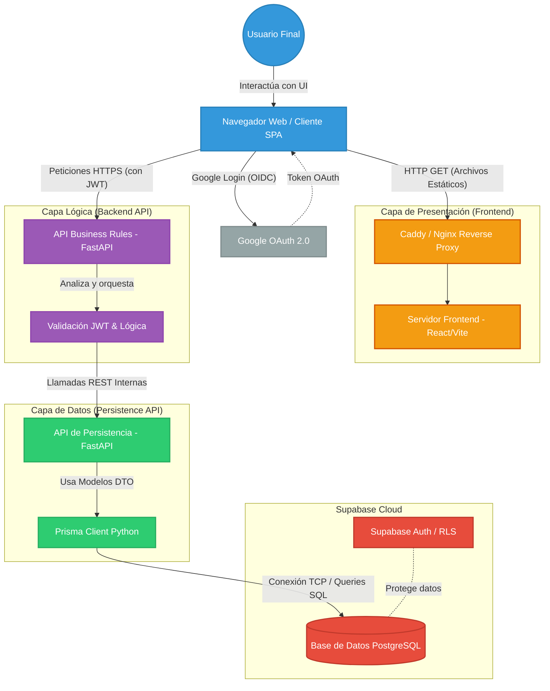

# 🏗️ Diagrama de Arquitectura de SharkHub

A continuación te presento el diagrama de la arquitectura del proyecto, modelado con **Mermaid** para mostrar cómo interactúan los 3 servidores descentralizados, el cliente y la base de datos externa.

Este diagrama ilustra el flujo de los datos y el desacoplamiento de las capas (Presentación, Reglas de Negocio, y Persistencia).

### Explicación del Flujo:
1. **Cliente / Frontend**: El usuario accede a la plataforma y el servidor Frontend (React) le entrega la interfaz. El login externo se procesa en el navegador a través de Google OAuth.
2. **Business Rules**: El frontend nunca toca la base de datos. Se comunica con el servidor `API_businessRules`, enviando su JWT. Este servidor valida la sesión, aplica reglas de negocio complejas y orquesta la petición.
3. **Persistencia**: Si la lógica es correcta, el servidor Business Rules hace una solicitud interna al servidor `persistence`. Este servidor usa `Prisma ORM` para ejecutar la acción en PostgreSQL de forma segura.
4. **Base de Datos**: Hospedada en Supabase (PostgreSQL), la cual proporciona capas extra de seguridad y control de sesiones nativo.
